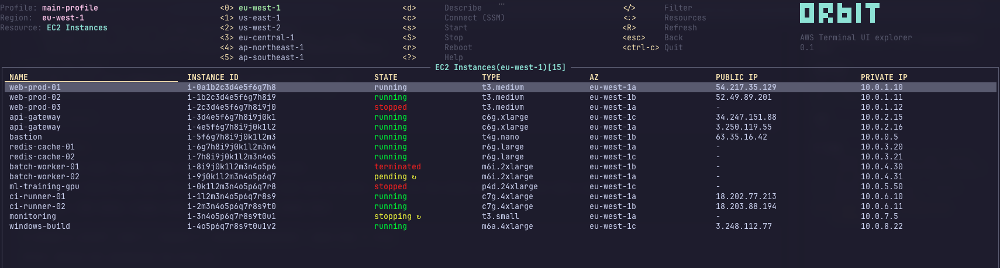
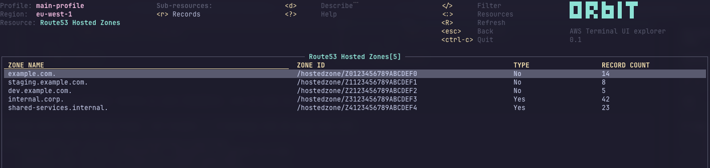

```
█▀█ █▀█ █▄▄ █ ▀█▀
█▄█ █▀▄ █▄█ █  █
```

# orbit — Terminal UI for AWS

Browse, observe and manage your AWS resources from the terminal. Keyboard-driven, vim-style navigation. Built for operators who live in the shell.

[](LICENSE)
[](https://www.rust-lang.org/)
[](https://crates.io/crates/orbit-tui)

<p align="center">
  
</p>

<p align="center">
  
</p>

## Install

```bash
brew tap doughlass/tap && brew install orbit   # macOS / Linux (Homebrew)
cargo install orbit-tui                         # via crates.io
docker run --rm -it -v ~/.aws:/root/.aws:ro ghcr.io/doughlass/orbit   # Docker
```

The crate is named `orbit-tui` (the name `orbit` was taken on crates.io). The installed binary is `orbit`.

Pre-built binaries for macOS (arm64/x86_64), Linux (musl arm64/x86_64) and Windows (x86_64) are available on the [releases page](https://github.com/doughlass/orbit/releases).

### From source

Requires Rust 1.94+ and a C compiler.

```bash
git clone https://github.com/doughlass/orbit.git && cd orbit
cargo build --release
./target/release/orbit
```

## Quick start

```bash
orbit                               # default profile and region
orbit --profile prod                # specific profile
orbit --region eu-west-1            # specific region
orbit --write                       # allow write operations (read-only is the default)
orbit --demo                        # synthetic data, no AWS connection
orbit --demo all                    # EC2 + Route53 + CloudFront demo
orbit --demo ec2-instances,cloudfront-distributions   # choose resources to demo
orbit --log-level debug             # write debug log
```

Shell completions for bash, zsh and fish:

```bash
eval "$(orbit completion bash)"     # add to ~/.bashrc
eval "$(orbit completion zsh)"      # add to ~/.zshrc
orbit completion fish | source      # add to config.fish
```

## Features

- **160+ resource views** across 60+ AWS services
- **Keyboard-driven** — vim keys, `:` command mode, `/` filtering
- **Fuzzy filtering** — client-side, or server-side AWS tag filters where supported
- **Sortable columns** — move a cursor over column headers with `←`/`→`, sort with `Tab`
- **Resource actions** — start, stop, terminate EC2 instances, view secret values, SSM shell connect
- **Data-driven** — every resource type is a JSON definition, no hardcoded keys in Rust
- **Multi-profile, multi-region** — SSO, role assumption, console login, credential chain
- **Demo mode** — `--demo` starts instantly with synthetic data for screenshots or testing
- **Read-only by default** — `--write` is required to enable any mutating operation
- **Pagination** — large resource lists with `]`/`[` keys

## Key bindings

| Key | Action |
|-----|--------|
| `j` `k` `↑` `↓` | Navigate items |
| `gg` / `Home` | Jump to top |
| `G` / `End` | Jump to bottom |
| `PgUp` `PgDn` `Ctrl+b` `Ctrl+f` | Page up / down |
| `]` `[` | Next / previous page |
| `Enter` | Describe resource or drill into sub-resource |
| `d` | Describe selected resource |
| `J` | JSON view |
| `:` | Command mode (`:profiles`, `:regions`, or a resource name) |
| `/` | Filter (fuzzy match or AWS tag filters) |
| `←` `→` then `Tab` | Move sort cursor, sort; `Shift+Tab` clears sort |
| `⇧←` `⇧→` (or `,` `.`) | Scroll table horizontally |
| `v` | Column visibility picker |
| `R` | Refresh |
| `0`–`5` | Quick region switch |
| `?` | Help |
| `Ctrl+c` | Quit |
| `Esc` `Backspace` | Go back |

Resource-specific actions appear in the help screen (`?`). Examples: `c` connects to EC2 via SSM, `x` reveals a secret value, `i` lists ECR images.

## Supported services

| Category | Service | Resources |
|----------|---------|-----------|
| **Compute** | EC2 | Instances, VPCs, Subnets, Security Groups, Network ACLs, Route Tables, Internet Gateways, NAT Gateways, Elastic IPs, Network Interfaces, VPC Endpoints, VPC Peering, Transit Gateways, AMIs, EBS Volumes, EBS Snapshots, Launch Templates, Key Pairs, Placement Groups, Dedicated Hosts |
| | Lambda | Functions, Layers, Aliases, Versions |
| | ECS | Clusters, Services, Tasks, Task Definitions |
| | EKS | Clusters, Node Groups, Fargate Profiles, Add-ons |
| | Auto Scaling | Auto Scaling Groups |
| | Step Functions | State Machines, Executions |
| **Storage** | S3 | Buckets, Objects, Bucket Policies, Lifecycle Rules, Replication Rules |
| | EFS | File Systems, Access Points, Mount Targets |
| | FSx | File Systems |
| | Backup | Backup Vaults, Backup Plans |
| **Database** | RDS | Instances, Aurora Clusters, Snapshots, Reserved Instances, Parameter Groups, Events |
| | DynamoDB | Tables |
| | ElastiCache | Clusters, Snapshots, Parameter Groups, Reserved Nodes, Events |
| | Redshift | Clusters, Snapshots, Reserved Nodes, Parameter Groups, Events |
| | DocumentDB | Clusters, Instances |
| | Neptune | Clusters, Instances |
| | Athena | Workgroups |
| | EMR | Clusters |
| | Glue | Jobs, Databases, Crawlers, Triggers |
| | MSK | Clusters |
| **Networking** | VPC Lattice | Services |
| | App Mesh | Meshes |
| | Cloud Map | Namespaces, Services |
| | CloudFront | Distributions |
| | Route 53 | Hosted Zones, Records |
| | Route 53 Resolver | Resolver Rules, Rule Associations, Endpoints |
| | ELB (v2) | Load Balancers, Listeners, Rules, Target Groups, Targets |
| | API Gateway | REST APIs, HTTP/WebSocket APIs (v2) |
| | AppSync | APIs |
| **Security** | IAM | Users, Groups, Roles, Policies, Access Keys, Instance Profiles, SAML Providers, OIDC Providers |
| | Secrets Manager | Secrets |
| | KMS | Keys, Aliases, Grants, Key Policies |
| | ACM | Certificates |
| | Cognito | User Pools, Identity Pools, App Clients |
| | WAF (classic) | Web ACLs, Rules, IP Sets |
| | WAFv2 | Web ACLs (regional + CloudFront), Rule Groups, IP Sets |
| | Shield | Protections, Protection Groups |
| | GuardDuty | Detectors |
| | Inspector | Findings |
| | Macie | Classification Jobs |
| | Security Hub | Standards |
| **Management** | CloudFormation | Stacks, Stack Events, Stack Outputs, Stack Resources |
| | CloudWatch | Alarms, Dashboards, Log Groups, Log Streams |
| | CloudTrail | Trails, Events |
| | SSM | Parameters, Documents, Managed Instances |
| | Config | Rules |
| | Service Quotas | Quotas |
| | Resource Groups | Groups |
| | Health | Events |
| | Trusted Advisor | Checks |
| **Messaging** | SQS | Queues |
| | SNS | Topics, Subscriptions |
| | EventBridge | Event Buses, Rules, Schedules |
| | Amazon MQ | Brokers |
| **Streaming** | Kinesis | Data Streams |
| | Data Firehose | Delivery Streams |
| **Containers** | ECR | Repositories, Images |
| **DevOps** | CodePipeline | Pipelines |
| | CodeBuild | Projects |
| **Migration** | Transfer Family | Servers, Users |
| | DataSync | Tasks |
| **Identity** | IAM Identity Center | Instances |
| | STS | Caller Identity |

## Authentication

orbit uses the standard AWS credential chain: environment variables → SSO → console login → `~/.aws/credentials` → `~/.aws/config` → IMDSv2.

For SSO: if your profile uses Identity Center and the token is expired, orbit prompts you to authenticate. If you already logged in via `aws sso login`, the cached token is reused.

For role assumption: `role_arn` with `source_profile` or `credential_source` (EC2, ECS, Environment) is fully supported.

Set `AWS_CA_BUNDLE` if you are behind a corporate proxy with SSL inspection.

For LocalStack: `orbit --endpoint-url http://localhost:4566`.

## Configuration

| Variable | Purpose |
|----------|---------|
| `AWS_PROFILE` | Default profile |
| `AWS_REGION` | Default region |
| `AWS_ENDPOINT_URL` | Custom endpoint (LocalStack) |
| `AWS_CA_BUNDLE` | Corporate SSL certificate bundle |

Logs: `~/Library/Application Support/orbit/orbit.log` (macOS), `~/.config/orbit/orbit.log` (Linux).

## Acknowledgments

Originally forked from [taws](https://github.com/huseyinbabal/taws) by Hüseyin Babal. Built with [Ratatui](https://github.com/ratatui-org/ratatui). Inspired by [k9s](https://github.com/derailed/k9s).

## License

Licensed under MIT. See [LICENSE](LICENSE) for details.

orbit is not affiliated with or endorsed by Amazon Web Services, Inc. "AWS" is a trademark of Amazon.com, Inc.
